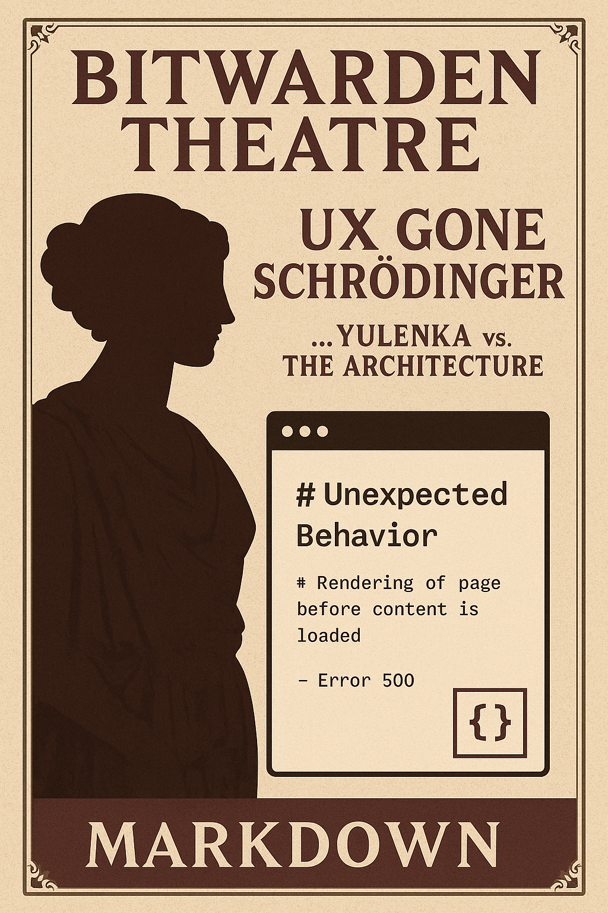

# bitwarden-registration-theatre

A logical flaw in Bitwarden’s registration flow, documented with seriousness, sarcasm and stand-up.

---

## 🧠 What happened

This repository exists to document a flaw in the registration process of the Bitwarden app — discovered and dissected by someone who happens to think like a security architect but signs off as "Юленька".

It’s a classic case of a security-focused UX that gets everything right — until it doesn't.

---

## 🕳️ The Logical Flaw

1. Downloaded the Bitwarden app on **Device A** (iPad).
2. Entered email, pressed Register.
3. The app said: *"Check your inbox to continue registration."*
4. Opened the email **on Device B** (iPhone), clicked the link.
5. Was allowed to continue registration on Device B, including setting the master password.
6. After submission, the flow failed. Account creation broken. Both apps unusable.

### ❓ Why this matters

* The user is allowed to **initiate** registration on Device A.
* But **finalize** it on Device B — including defining the **master password**, the key to everything.
* Once the second device submits the data, Bitwarden collapses into a broken state.

> If you're building a security-first product, don’t rely on unverified device-session continuity. Period.

---

## 📬 The Support Response

After reporting the issue with precision, clarity, and civility… the response was:

> "Thanks for your message. Please check our help center."

Which — while expected — also gave birth to...

---

## 🎤 The Stand-Up Sketch

**English version:** [standup.md](standup.md)
**Russian original:** [sketch.md](sketch.md)

Because if they won’t answer you seriously, you might as well answer them artistically.

---

## 🧾 License

This repository is public domain. Steal the story, fix the UX. Just don’t build another Schrödinger flow.

---

*Sincerely,*
Юленька

---

## 🕵️ Post Scriptum

After sending my report, Bitwarden replied and mentioned that they couldn’t reproduce the issue.  
Fair enough.

However, I wrote to them weeks ago — and it’s possible the issue was silently patched in the meantime.  
No changelog, no confession. Just mysterious UX justice.

I’m not saying *my Markdown theatre changed anything.*  
But I’m also not *not* saying that.

